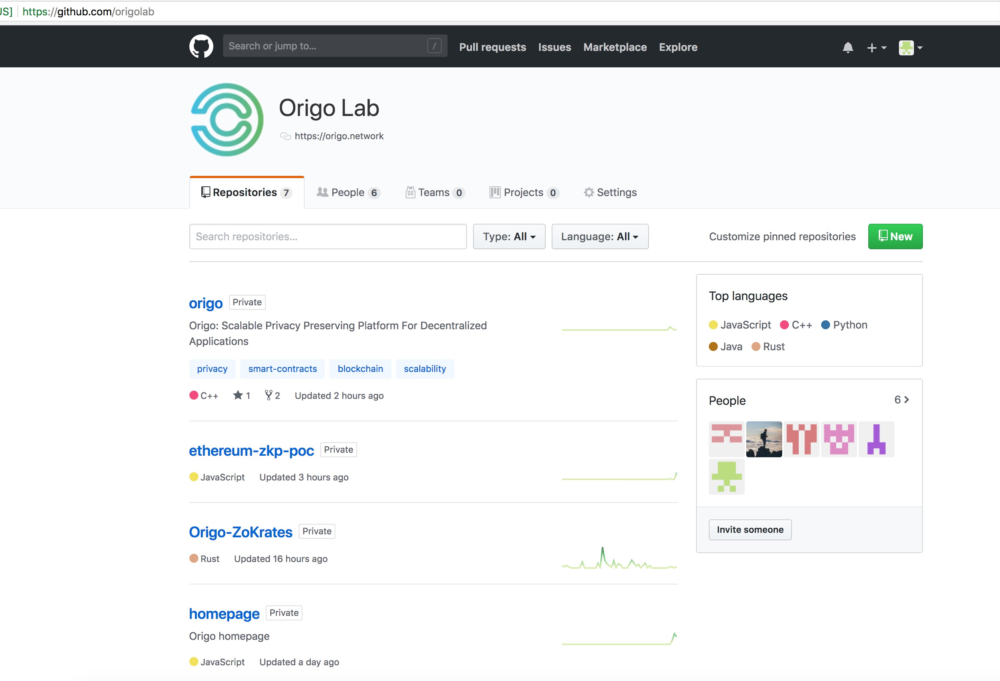
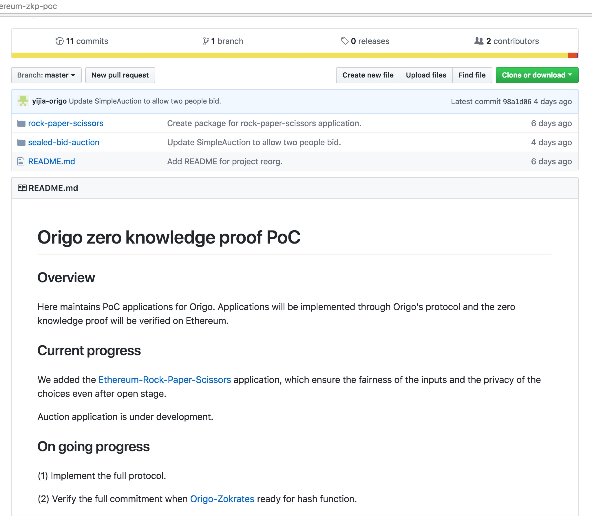
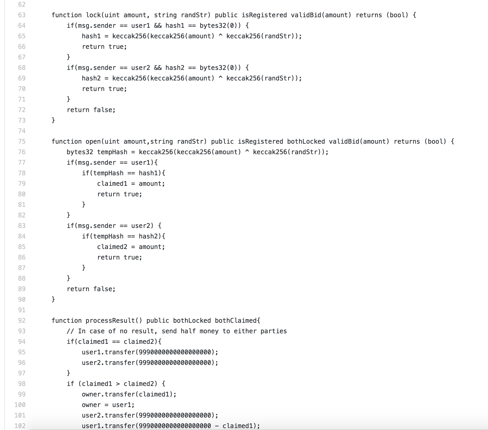
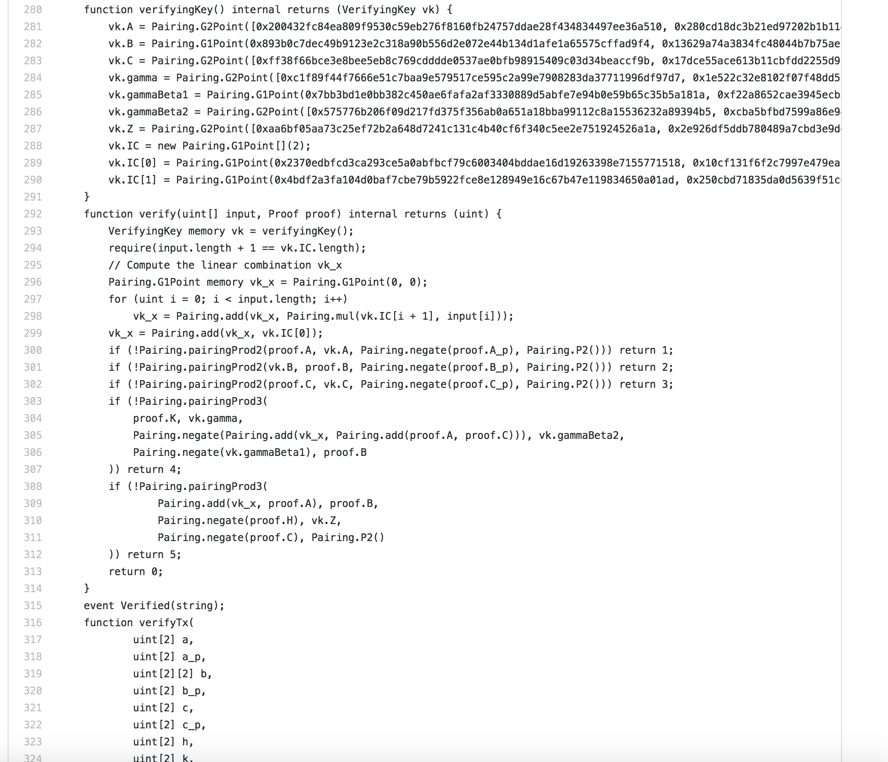
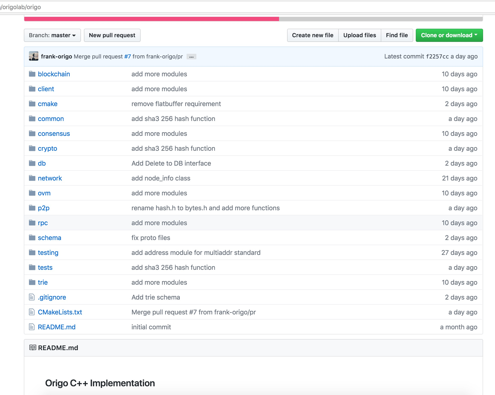
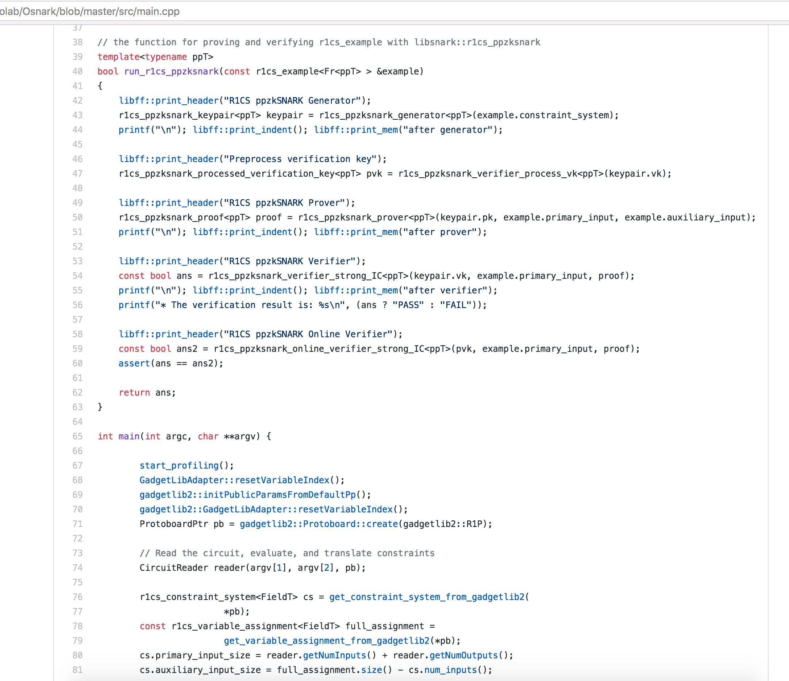

# Origo Network: Privacy Blockchain with Off-chain Computation
https://origo.network/

## Summary
Origo is a protocol + blockchain that uses zero knowledge proofs to keep transactions and smart contract input/outputs private. Trusted setup is used for private transactions, while untrusted setup is used for smart contract execution (which is off-chain). Origo is also working on privacy toolchains, eg. a developer friendly secure random function.

## Token metrics
Not public

## Market opportunity/Competitive analysis
- There are quite a few privacy blockchains that support smart contracts
- No market leader yet
- Focusing on protocol first, blockchain second, gives Origo an advantage in getting to market

## Team/Advisors/Partnerships
### Core members
- Everyone from CMU has been confirmed in the alumni directory
- Everyone has been confirmed to be full time, except Zikai Wen who is a PhD student

- **[Frank Fang](https://www.linkedin.com/in/fangjian/)** (Blockchain Lead/Core Contributor)
  - Pinterest: Senior Software Engineer on the systems team. Distributed systems.
  - Carnegie Mellon '14 MSIT in Very Large Information Systems. Took some of the same high level courses as me according to LinkedIn. These courses are legit.

- **[Yijia Zhang](https://www.linkedin.com/in/yijia-zhang-51a9b534/)** (Core Contributor)
  - Google: Software Engineer. Google Assistant founding team member.
  - Carnegie Mellon '12, MS in Comp Sci
  - Peking Univ. '11, Bachelor's in Economics
  - Tsinghua Univ. '11, Bachelor's in CS

- **Baron Gong** (Core Contributor)
  - Columbia University: MS in MS&E
  - ICM (Interdisciplinary Contest in Modeling) Outstanding Winner

- [Dr Weiran Liu](https://www.zhihu.com/people/liu-wei-ran-8-34/activities) (Core Contributor)
  - \> 16k followers on Zhihu in the cryptography domain
  - Beijing University of Aeronautics and Astronautics: PhD Cryptography

- **Zikai Wen** (Technical Contributor)
  - [Hawk: The Blockchain Model of Cryptography and Privacy-Preserving Smart Contracts](https://eprint.iacr.org/2015/675.pdf). **The other co-authors of this paper include Ahmed Kosba ([jsnark](https://github.com/akosba/jsnark)) and Elaine Shi ([ThunderToken](https://www.thundertoken.com/))**.
  - 4th year PhD student @ Cornell

- **Xin Wu** (Technical Contributor)
  - CMU MS Comp Sci, Tsinghua BS Comp Sci
  - Google senior software engineer, anti-fraud team Tech Lead (+ Search, YouTube behavior analysis)
  - Developed arbitrage system for blockchain

- **Gavin Wang** (Technical Contributor)
  - CMU MS Comp Sci, Tsinghua BS Comp Sci
  - Google senior software engineer (Search, Web Answer, other)
  - Machine learning, AI, deep learning, quant trading

- **Hong Chai** (Marketing)

- **[Sonia Wang](https://www.linkedin.com/in/%E6%99%B6-%E7%8E%8B-271020164/)** (Core Contributor)
  - Experience in financial media, head of branding

### Advisors
  - Vincent Zhou (founding partner of FBG Capital)
  - Howard Wu (Advisor to Blockchain at Berkeley)
  - *more to be announced*

## Competitive Advantage
- Working with 2 unannounced companies (in industries where privacy is tantamount)
- Connected to the primary authors of Jsnark and ZoKrates

## Tokenomics and Token Utility
- Users pay a fee to utilize the network (eg. Ethereum)
- Validators get block/computing rewards
- Executors make a deposit to prevent misconduct, and gets rewarded for completing a privacy related task
- Very early stage on tokenomics - will likely need to wait until Origo starts focusing more man-power on the blockchain stage

## Progress Overview
*06/21/2018 - Origo has told me that some repos will be open-sourced in the next few weeks. Currently, since all the code is sitting in a private org on Github, I had a call with the core team for a code and development roadmap walkthrough.*

There are two overall stages in Origo's development schedule:
1. Protocol + ZKP tech, then
2. Blockchain.

As a company started in Feb 2018, Origo is still in the 1st stage. Specifically, they've finished a proof-of-concept of the Protocol, as well as a proof-of-concept of the ZKP tech. Here's the progress so far, as shared by the team:

- **February - April**: Designing the protocol + ZKP tech, discussions with academia. Realizing the optimal solution would be to design a new blockchain, rather than building on top of Ethereum.
- **Late April - Early May**: Designing a new blockchain that is optimized for the protocol
- **Since May**: Start coding the basic building blocks of a new chain structure, however, majority of team resources are spent on the privacy protocol. All the focus is on privacy for now, while scalability is later
- blockchain with testnet: 1-2 months
- privacy toolchain is planned, eg. a dev friendly secure random function

As part of initial research, the Origo team thoroughly tested all the related tools (ZoKrates, jsnark) in order to find the limitations of each. Based on this knowledge, they then designed a protocol that could run on this setup (aka the proof-of-concept), while simultaneously designing replacements and additional toolchains to eventually remove the original limitations.

The Origo protocol includes **onchain/offchain communication**, **offchain proof generation**, and **onchain verification**. Their proof-of-concept is intended to show this protocol working, before they start building more fundamental pieces based on this protocol. Now that their proof-of-concept is done, they have started their chain framework with fundamental building blocks.

*While at first glance it may seem that Origo does not have much development progress, there are many subtleties that are non-trivial (shown especially with their collaboration with Jacob Eberhardt, the owner of ZoKrates, and Zikai Wen's involvement). This is detailed in the `Code` section.*

## Code

The Origo repo consists of
- **origo**: the new blockchain

- **osnark**: Origo's circuit builder and reader.

- **ethereum-zkp-poc**: proof-of-concept with verification on Ethereum

- **origo-ZoKrates**: origo fork of [ZoKrates](https://github.com/JacobEberhardt/ZoKrates), with updates. ZoKrates is a proof-of-concept zkSNARKs implementation, and uses a python-like language which compiles to R1CS (shown in figure below). The original library only handles `mult` and `add` arithmetic gates. Origo has added `mod`, and is working with JacobEberhardt on adding bit manipulation and hashing, along with a new compiler so Solidity can be used instead of the python-like [DSL](https://en.wikipedia.org/wiki/Domain-specific_language) ([examples](https://github.com/JacobEberhardt/ZoKrates/tree/develop/examples)). Hashing is used for computing commitment, and encryption is used for sending encrypted data to the blockchain and then to offchain. The original ZoKrates SHA256 implementation has very low performance due to the lack of bit manipulation.

- **origo-jsnark**: origo fork of [jsnark](https://github.com/akosba/jsnark). Jsnark helps you build arithmetic circuits with code, using the [pinocchio compiler](https://eprint.iacr.org/2013/279.pdf). The origo fork of jsnark is updated to use the newest version/api of libsnark, which is significantly different than the original repo.

  > Pinocchio allows the worker to include private inputs in the computation and prove that she performed the computation correctly without revealing any information about the private inputs to the client.
  >
  > [Pinocchio: Nearly Practical Verifiable Computation](https://cacm.acm.org/magazines/2016/2/197429-pinocchio/abstract)

Some background knowledge on zkSNARK from the [Vitalik blog](https://medium.com/@VitalikButerin/quadratic-arithmetic-programs-from-zero-to-hero-f6d558cea649):

> The steps here can be broken up into two halves. First, zk-SNARKs cannot be applied to any computational problem directly; rather, you have to convert the problem into the right “form” for the problem to operate on. The form is called a “quadratic arithmetic program” (QAP), and **transforming the code of a function into one of these is itself highly nontrivial**. Along with the process for converting the code of a function into a QAP is another process that can be run alongside so that if you have an input to the code you can create a corresponding solution (sometimes called “witness” to the QAP). After this, there is another fairly intricate process for creating the actual “zero knowledge proof” for this witness, and a separate process for verifying a proof that someone else passes along to you, but these are details that are out of scope for this post.
>
> --- [Quadratic Arithmetic Programs: from Zero to Hero. (2016, Dec 11)](https://medium.com/@VitalikButerin/quadratic-arithmetic-programs-from-zero-to-hero-f6d558cea649)

Referring to this quote, we can see that jsnark+osnark tackle a complex part of ZK proof pipeline, which is transforming the code of a function into something zk verifiable. `Osnark` is being developed so that eventually, Solidity can be compiled into something zk verifiable.

#### The Origo Protocol

The Origo Protocol has 4 phases, Init, Commit, Execute, Settle. 

**Init**: A Node is elected and its public key is shared to all involved parties.

**Commit**: Each party submits their input and coins privately. Since nobody can see anyone else's inputs, a participant cannot base their inputs off of someone else's inputs.

**Execute**: Each party encrypts its private input and coins information with an executor's public key. A zk proof is built to prove the encrypted value matches the commitment. This verification is done on-chain, and once finished, the blockchain sends the encrypted data to an executor node. Executor uses its private key to decrypt the private inputs, and executes the smart contract on the node itself. This runs using ZoKrates in the proof of concept.

**Settle**: The executor builds a proof to prove the outputs are correctly computed from the inputs, and encrypts output with each party's public key. The executor sends the proof and the encrypted outputs to blockchain, where it is verified on-chain. Each party can uze their private key to decrypt the output.

PoC repo. 2 simple demos, each with an original smart contract and a modified smart contract with verification code included.  The  `execute` phase is run off-chain within the ZoKrates environment, where ZoKrates generates the output and proof. Then, the off-chain environment calls `verify` in the smart contract with the ZoKrates output as an argument, to verify it on-chain. 

I was given a functional demo of the sealed bid auction, running with Metamask and Ganache. (continues)

For example, here's the sealed bid auction smart contract. It's a fairly straightforward contract, where both bidders `lock` an amount confidentially (Commit Phase), both bidders `open` to claim their winnings (Execute Phase), then `processResult()` to create the transactions (Settle Phase). There is a corresponding piece of code written in ZoKrates DSL that includes the same logic as `processResult` to execute off-chain (I saw the code for this, but didn't get a screenshot). To remove this redundancy, Origo is writing a Solidity compiler for zksnarks (the `osnark` repo). (continues)

Here's the corresponding zk verification code. This code verifies that the outputs of ZoKrates matches the inputs from each party (on-chain). I think `./zokrates export-verifier`  generates something like this. 

origo blockchain repo. We did not go over this in the walkthrough, as they suggested it was very new and relatively bare.

osnark repo with circuit builder, below.

circuit_builder code. I wasn't very familiar with arithmetic circuits until reviewing this project, but the code looks good to me. The screenshot is code that verifies the wires between each arithmetic gate in a circuit. There is plenty of [research](http://ieeexplore.ieee.org/document/7442835/) [out](http://scholarworks.umass.edu/cgi/viewcontent.cgi?article=1210&context=masters_theses_2) [there](http://www.cs.cmu.edu/~bryant/pubdir/dac95a.pdf) for verifying arithmetic circuits, but this code is novel.

The code that runs and outputs the text below.

Setup, proving and verification. The last 1s of the animation is the verification step, to show zk verification is very quick. This was part of their benchmarking tests, and extensively uses ZoKrates.

### Conclusion

For a 4-5 month old project, Origo has made about as much progress as I'd expect from a good team. The team members have impressive backgrounds, and it's clear that they deeply understand the existing research (+ research done by some team members), and know how to utilize it to build a beginning to end proof of concept. 

Compared to the scope of the whitepaper (aka project architecture), this code is relatively early stage. 

Unlike many projects, most of the work has been in the testing, benchmarking, and design phase, rather than the build phase. That is understandable as most experienced engineering projects are like this, but it's difficult to show this progress in a code review. 

To demonstrate their progress, they showed me how they benchmarked these existing tools, and all the shortcomings and limitations they've come across while using these tools. Meanwhile, they have also designed and implemented a new circuit compiler framework — something necessary for getting fully independent from ZoKrates.

With additional implementation, Origo has the potential to be a strong contender in the private smart contract space. I'd like to revisit this project in a couple weeks to update the review. 

## Other Info

Origo's network requires verifying off-chain computation verification took place (to remove the trusted setup requirement from zkSNARKs)

zkSNARKs also requires trusted setup, which Origo has decided is fine for transactions, but not acceptable for smart contract computations. While trusted setup works in some cases, for example if the contract is from a reputable company willing to do trusted setup, no trusted setup works for everyone else.
